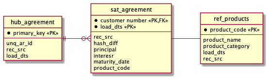

# Testing performance with PostgreSQL and Citus in Data Vault tables

This repository contains scripts to assess the performance of a PostgreSQL Citus database. The experiment can be run using the following command:

```
bash experiment.sh <hostname> <dbname> <user>
```

The script assumes that the test data csv's are available. These can be generated using the included Python script:

```
python generate-csv.py
```

## The experiment
We have three tables that are commonly found in a data vault model: a Hub, a Satellite and a Reference table. They are described in the diagram below.



In this experiment, we want to find out the performance of COPY-ing data into the tables and for retrieving the data again.
We apply distribution using Citus and create indexes, with the goal to see how these impact that performance.
Then, we also retrieve everything we have inserted into the three tables to see the performance on that end.
This is an initial exploration of how to build a Data Vault model in Azure PostgreSQL Hyperscale.

## Parameters
We always have 10000 Hub inserts and then the Sat and Reference table inserts are a multiple of that (multipliers: 1, 10, 100, 500, 2500).
You can also configure the number of times you want to execute the experiment. This can be convenient if you let your machine run during the night. Regardless of whether you configure the number of runs or you just call the script multiple times, the results are always appended (so not overwritten) into the appropriate file.
This way you always have all test results from a specific combination of parameters in one file together.
